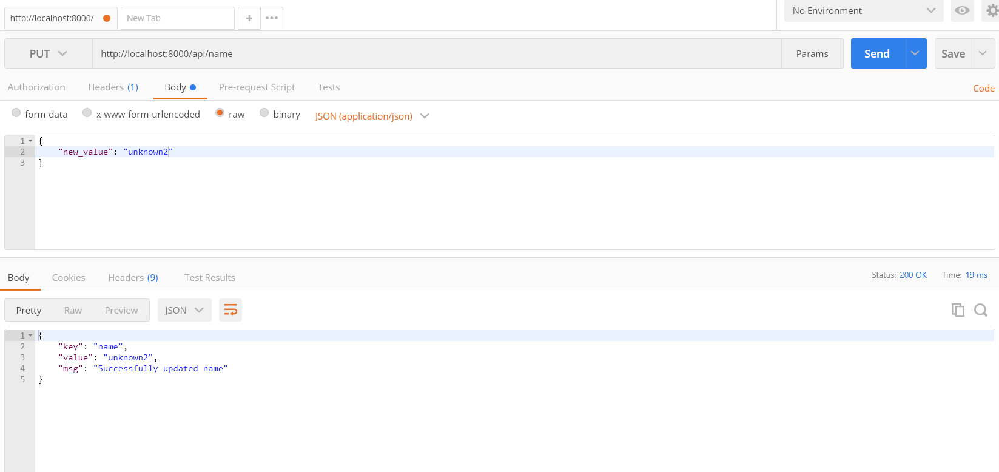
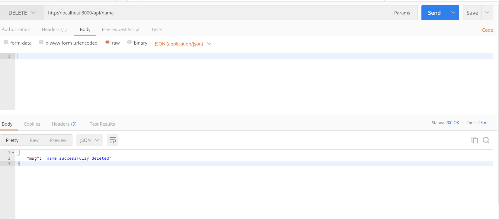

# Redis as a Key-Value Store in Django

- [Redis as a Key-Value Store in Django](#redis-as-a-key-value-store-in-django)
  - [How to run](#how-to-run)
  - [Redis](#redis)
  - [Setting up Redis](#setting-up-redis)
  - [Redis Commands](#redis-commands)
  - [Django Set up](#django-set-up)
  - [Django and Redis](#django-and-redis)
    - [View](#view)
    - [URLs](#urls)
  - [Testing](#testing)
  - [Conclusion](#conclusion)

## How to run

```cmd
git clone https://github.com/sunilale0/django-redis-key-value-store.git
cd django-redis-key-value-store
```

set up a virtual environment and then

```cmd
pip install -r requirements.txt

python manage.py migrate
python manage.py runserver
```

Set up [Redis-Cli](#setting-up-redis) and [test](#testing). Here, we are assuming that redis port is `6379`, if it is different, set that value in `django_redis/settings.py` through variable `REDIS_PORT` .

## Redis

Common use cases of Redis include

- Caching - It's faster than traditional databases. So, it is used for temporary data storage and retrieval.
- Message Queueing - Redis can also be used as a message broker for message queueing systems through its Publish/Subscribe messaging paradigm
- Data Storage - Redis can be used to store key-value data as NoSQL database

Example use: Twitter stores the most recent incoming tweets for a user on Redis to speed up the delivery of the tweets to client applications
Pinterest uses Redis to store a list of users and boards a user follows, a list of a user's followers, and a list of people who follow your boards, among other lists to enchance the experience on the platform.

## Setting up Redis

For windows go to [here](https://github.com/microsoftarchive/redis/releases), download a `.msi` file with `latest release` tag.

For Mac/linux there is installation guide on their [site](https://redis.io/download).

## Redis Commands

Once it is verified that redis is installed.
Enter Redis-cli by using the command. Remember the port number for later.

```cmd
redis-cli
```

Try out the commands below:

```cmd
// SET sets a key hello with the value of "world" with an expiry of 10 seconds, "EX 10" is optional
SET hello "world" EX 10

// GET gets the value associated with the key hello
GET hello

// DEL deletes a key and the associated value
DEL hello

// GET gets the value associated with the key hello
GET hello

// if a key is set with expiry, we use TTL to view how much time is left
TTL hello

// use PERSIST to remove the expiry period
PERSIST hello

// use RENAME renames the key "hello" to "hello2"
RENAME hello hello2

// use FLUSHALL to delete all of the key-value entries in the current session of Redis
FLUSHALL
```

## Django Set up

Here, we will build an API using DJango and Django REST framework that can receive a key-value pair and store it in our Redis Server.
Features:

- Retrieve values for given keys
- Retrieve all key-value pairs stored
- delete a key-value entry

Create a virtual environment and activate

```cmd
py -m venv venv
venv\Scripts\activate

```

Install `django` `djangorestframework` and `redis`

```cmd
pip install django djangorestframework redis

```

Start a project, create an app and migrate the models to the database

```cmd
django-admin startproject django_redis .
django-admin startapp api
python manage.py migrate
python manage.py runserver
```

Add our app `api` and `django REST framework` to our project by adding the following inside `INSTALLED_APPS` list found in `django_redis/settings.py`

```python

"rest_framework",
"api",
```

Provide Host and Port number of Redis to Django by including the following in `django_redis/settings.py`

```python
REDIS_HOST = "localhost"
REDIS_PORT = 6379
```

Note: for now we will use a local Redis Instance, but a remote or Docker containerized instance of redis can also be used in the same way: defining the host and port.

## Django and Redis

### View

Inside `api/views.py` start by importing some necessary libraries:

```python
import json
from django.conf import settings
import redis
from rest_framework.decorators import api_view
from rest_framework import status
from rest_framework.response import Response

# Connect to our Redis instance
redis_instance = redis.StrictRedis(host=settings.REDIS_HOST, port = settings.REDIS_PORT, db = 0)
```

Now add a view `manage_items()` which will be used to retrieve all the items currently set in our running Redis instance, and to create new entries in our Redis instance by passing a JSON object:

```python

@api_view(["GET", "POST"])
def manage_items(request, *args, **kwargs):
    if request.method == "GET":
        items = {}
        count = 0
        for key in redis_instance.keys("*"):
            items[key.decode("utf-8")] = redis_instance.get(key)
            count += 1
        response = {
            "count": count,
            "msg": f"Found {count} items.",
            "items": items
        }
        return Response(response, status=200)
    elif request.method == "POST":
        item = json.loads(request.body)
        key = list(item.keys())[0]
        value = item[key]
        redis_instance.set(key, value)
        response = {
            "msg": f"{key} successfully set to {value}"
        }
        return Response(response, 201)
```

add another function `manage_item()` inside `api/views.py` that will be used to create, update and delete a single key-value in the Redis instance:

```python

@api_view(["GET", "PUT", "DELETE"])
def manage_item(request, *args, **kwargs):
    if request.method == "GET":
        if kwargs["key"]:
            value = redis_instance.get(kwargs["key"])
            if value:
                response = {
                    "key": kwargs["key"],
                    "value": value,
                    "msg": "success"
                }
                return Response(response, status=200)
            else:
                response = {
                    "key": kwargs["key"],
                    "value": None,
                    "msg": "Not Found"
                }
                return Response(response, status=404)
    elif request.method == "PUT":
        if kwargs["key"]:
            request_data = json.loads(request.body)
            new_value = request_data["new_value"]
            value = redis_instance.get(kwargs["key"])
            if value:
                redis_instance.set(kwargs["key"], new_value)
                value = redis_instance.get(kwargs["key"])
                response = {
                    "key": kwargs["key"],
                    "value": value,
                    "msg": f"Successfully updated {kwargs['key']}"
                }
                return Response(response, status=200)
            else:
                response = {
                    "key": kwargs["key"],
                    "value": None,
                    "msg": "Not found"
                }
                return Response(response, status=404)

    elif request.method == "DELETE":
        if kwargs["key"]:
            result = redis_instance.delete(kwargs["key"])
            if result == 1:
                response ={
                    "msg": f"{kwargs['key']} successfully deleted"
                }
                return Response(response, status=200)
            else:
                response = {
                    "key": kwargs["key"],
                    "value": None,
                    "msg": "Not found"
                }
                return Response(response, status=404)

```

`manage_item()` wil use a key of the item passed in the URL, to identify and perform the indicate operation: `GET`, `PUT` or `DELETE`.

### URLs

Now, create a new file in `api/` caled `urls.py` and add the following:

```python
from django.urls import path
from rest_framework.urlpatterns import format_suffix_patterns
from .views import manage_items, manage_item

urlpatterns={
    path("", manage_items, name="items"),
    path("<slug:key>", manage_item, name="single_item")
}
urlpatterns = format_suffix_patterns(urlpatterns)

```

Finally include `api/urls.py` in the main project by adding the following in `django_redis/urls.py`:

```python
from django.urls import path, include # include added

urlpatterns = [
    # ...,
    path("api/", include("api.urls")),
]
```

## Testing

We can directly visit `http://localhost:8000/api/` to view, we can only view what is stored in our Redis instance from here, which is nothing.
So, go to `redis-cli` and add some values like:

```cmd
SET hi "hello"
SET oh "no"
```

reload `http://localhost:8000/api/`.
We can also see a value in a key by doing `http://localhost:8000/api/hi`.
But to update a value and to post a value we need to use [Postman](https://www.postman.com/downloads/). Download and install.

After installing, open it. You will see a signup option, but there will also a `link` to skip signing up and go directly into the application.

there, test the addresses used above in `GET` mode.

`POST` test:
select address `http://localhost:8000/api/name`
select `POST`, got to Body tab and select raw and select `JSON(application/json)` and add the following:

```json
{
  "name": "unknown"
}
```

hit send. You should see a message below that says

```json
{
  "msg": "name successfully set to unknown"
}
```

`PUT` test:
select address `http://localhost:8000/api/name`
select `PUT`, got to Body tab and select raw and select `JSON(application/json)` and add the following:

```json
{
  "new_value": "unknown2"
}
```

hit send. You should see a message below that says

```json
{
  "key": "name",
  "value": "unknown2",
  "msg": "Successfully updated name"
}
```

`PUT` in postman looks like the following


`DELETE` in postman will look like the following:


## Conclusion

A simple django application with djano REST framework and storage operations on `redis` is now complete.

Thanks [StackAbuse](https://stackabuse.com/working-with-redis-in-python-with-django/) for the tutorial. Report issues [here](https://github.com/sunilale0/django-redis-key-value-store/issues). Ideas go [here](https://github.com/sunilale0/django-redis-key-value-store/discussions).
